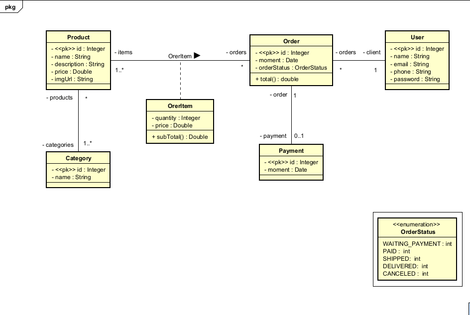

# ecommerce-backend-api

[](https://www.java.com)
[](https://spring.io/projects/spring-boot)
[](https://opensource.org/licenses/MIT)

API RESTful de backend para um sistema de e-commerce, construída com Spring Boot 3, Java 21 e JPA/Hibernate.

> ⚠️ **Nota Importante:** Este é um projeto de estudo focado na transição de carreira. O seu principal objetivo é aplicar e demonstrar conceitos de desenvolvimento backend com o ecossistema Spring, desde a modelagem de dados até a implementação de endpoints RESTful.

---

## 🎯 Sobre o Projeto

Este projeto consiste na criação de uma API RESTful para um sistema de gestão de pedidos (e-commerce). O seu desenvolvimento foi motivado pelo meu objetivo de transição de carreira para a área de desenvolvimento de software backend, aplicando as melhores práticas de design de API e persistência de dados.

A API é responsável por gerir as entidades centrais de um e-commerce, como utilizadores, produtos, categorias e pedidos.

## 🛠️ Tecnologias Utilizadas

O desenvolvimento deste projeto baseou-se nas seguintes tecnologias:

* **Linguagem:** Java 21
* **Framework:** Spring Boot 3
* **Persistência:** Spring Data JPA / Hibernate
* **Gestão de Dependências:** Maven
* **Banco de Dados (Testes):** H2 Database (em memória)
* **Banco de Dados (Produção/Dev):** PostgreSQL

## 📊 Modelo de Domínio (UML)

O design do sistema foi baseado no seguinte Diagrama de Classes UML, que define as entidades e os seus relacionamentos. Esta modelagem foi uma etapa crucial do projeto.




## ✨ Funcionalidades Principais

* **CRUD de Utilizadores:** Operações completas de criação, leitura, atualização e exclusão de utilizadores (CRUD).
* **Gestão de Pedidos e Produtos:** Estrutura para listagem de produtos, categorias e pedidos dos utilizadores.
* **Modelo de Domínio Robusto:** Implementação de um modelo de dados relacional complexo usando JPA/Hibernate, incluindo relações:
    * Um-para-Muitos (Ex: `User` <-> `Order`)
    * Muitos-para-Muitos (Ex: `Product` <-> `Category`)
    * Um-para-Um (Ex: `Order` <-> `Payment`)
* **Tratamento de Exceções:** Implementação de um *handler* global para capturar erros e retornar respostas de API padronizadas.

## 🚀 Como Executar o Projeto Localmente

Para executar este projeto na sua máquina local, siga estes passos:

1.  Certifique-se de ter o **Java 21 (JDK)** e o **Maven** instalados.
2.  Clone este repositório:
    ```bash
    https://github.com/Joao-Victor-Teixeira/ecommerce-backend-api
    ```
3.  Navegue até a pasta raiz do projeto.
4.  Execute o projeto usando o Maven (utilizando o perfil de teste com H2):
    ```bash
    mvn spring-boot:run -Dspring-boot.run.profiles=test
    ```
5.  A aplicação estará disponível em `http://localhost:8080`.
6.  O banco de dados em memória H2 pode ser acedido em: `http://localhost:8080/h2-console`
    * **JDBC URL:** `jdbc:h2:mem:testdb`
    * **Username:** `sa`
    * **Password:** (deixe em branco)

## 📄 Licença

Este projeto está licenciado sob a Licença MIT. Veja o arquivo [LICENSE](LICENSE) para mais detalhes.
